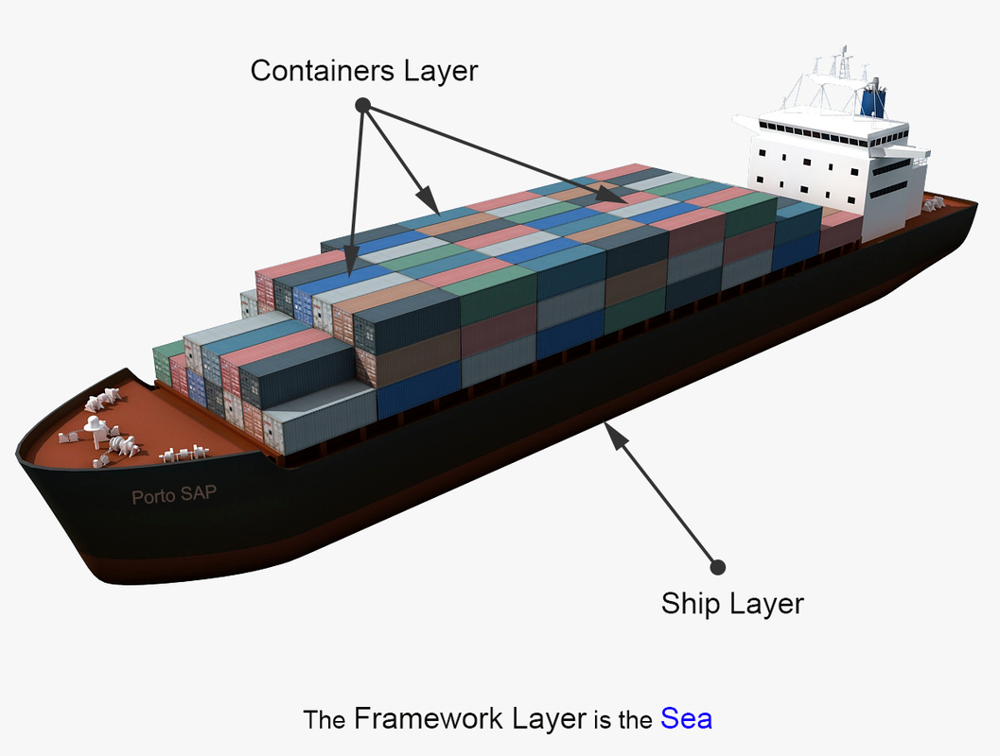
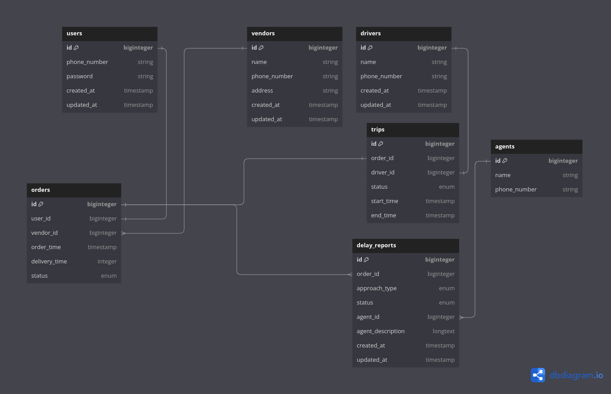

# داکیومنت فنی سیستم اعلام تاخیر سفارش‌ها

## تکنولوژی‌های استفاده شده:
- PHP
- Laravel Framework
- PostgreSQL
- Redis
- Docker


## نحوه‌ی اجرا:
برای شروع، ابتدا فایل `.env` را ایجاد کنید:
`cp .env.example .env`

سپس، با استفاده از ابزار `Makefile` و دستور `make dev`، تمام وابستگی‌های پروژه نصب می‌شوند و کانتینر نرم‌افزار بر روی پورت ۸۰ آماده‌ی استفاده می‌شود.

کالکشن APIهای پست‌من برای تست در پوشه‌ی `docs` قرار دارد.

نحوه‌ی اجرای تست‌ کیس‌ها به صورت زیر میباشد:
```bash
make test
```

---
## معماری نرم‌افزار:
برای توسعه‌ی این نرم‌افزار،‌ معماری ماژولار را انتخاب کردم. این انتخاب بر اساس تفکری است که بهبودپذیری، قابلیت توسعه و مدیریت و نگه‌داری آسان تری در طول زمان را تضمین می‌کند. فرض بر این گذاشته شد که نرم‌افزار فعلی Monolothic می‌باشد و هر اسکواد قرار است بر روی یکی از ماژول‌های این نرم‌افزار کار کند.

ساختار معماری به صورت Ship/Container می‌باشد.
در لایه‌ی Container بیزینس لاجیک نرم‌افزار قرار میگیرد و در لایه‌ی Ship کد‌های زیرساختی. مثلا Redis Adapter که بین همه‌ی کانتینرها مشترک هست. از طرفی در لایه‌ی Ship امکان این رو داریم که تا حدودی وابستگی ماژول‌ها رو به فریم‌ورک کمتر کنیم.

برای ارتباط بین ماژول‌ها، در ماژول مبدا، یک Facade به عنوان یک واسط سطح بالا ایجاد شده است. این Facade شامل متدهایی است که ماژول‌های دیگر نیاز دارند تا با ماژول مبدا ارتباط برقرار کنند. در ماژول مقصد، از طریق لایه‌ی Adapter، با ماژول مبدا ارتباط برقرار می‌کنیم. در اینجا، یک شی از ماژول مقصد ایجاد شده و با استفاده از متدهای مورد نیاز، اقدام به اجرای عملیات مرتبط با ماژول مبدا می‌نماییم. مهمترین نکته این است که ما در خود ماژول مقصد، تنها از آداپتر استفاده می‌کنیم و از جزئیات پیچیده ارتباط با ماژول مبدا درون Facade پنهان می‌شود. این ساختار باعث می‌شود که تغییرات در ماژول مبدا بدون تأثیر مستقیم بر ماژول مقصد اعمال شود، و این انعطاف‌پذیری و قابلیت گسترش سیستم را بهبود می‌بخشد.

داکیومنت الگوی معماری نرم‌افزار: https://github.com/Mahmoudz/Porto



---

## ماژول‌ها:
در نرم‌افزار توسعه‌ داده شده ما ۶ ماژول مستقل از همدیگر داریم.

#### User Module:
در این ماژول سرویس احراز هویت، مدل کاربر (مشتری) و مایگریشن‌های مربوطه رو داشتیم.
ما میتونستیم اگر دید بهتری نسبت به Business Domain و نحوه‌ی احراز هویت داشتیم،‌ کارمند و پیک (Driver) رو هم در این ماژول پیاده کنیم. اما با فرض اینکه کاربر، کارمند و پیک هرکدام ماژول یا سرویسی جدا هستند من برای هرکدوم از این موجودیت‌ها یک ماژول جدا تعیین کردم.

#### Vendor Module:
این ماژول مختص به فروشگاه هستش.

#### Delivery Module:
در این ماژول ما موجودیت‌های سفارش و سفر (Trip) رو داریم. با دید فعلی که نسبت به Business Domain داشتم و این ایده رو داشتم که سفر و سفارش با هم دیگه ارتباط نزدیکی دارن، این دو موجودیت رو در یک ماژول قرار دادم.

#### Delivery Audit
در این ماژول ما سیستم اعلام تاخیر سفارش‌ها رو پیاده سازی کردیم.

---

## جداول پایگاه‌داده:

لینک دسترسی به دیاگرام: https://dbdiagram.io/d/Snappfood-task-656080773be1495787a938f1

---

## صف گزارش‌های تاخیر

برای مدیریت صف گزارش‌های تاخیر، از سیستم Redis Queue بهره گرفتم. زمانی که یک درخواست از طریق وب‌سرویس اعلام تاخیر توسط کاربر اجرا می‌شود، ابتدا در sets ردیس بررسی می‌شود که آیا برای این گزارش در لیست صف، موردی وجود دارد یا خیر. اگر وجود نداشت، یک عضو به sets افزوده و آیدی گزارش به لیست صف delay_reports اضافه می‌شود. زمانی که پشتیبان API درخواست دریافت گزارش را اجرا می‌کند، اولین گزارشی که وارد صف می‌شود به پشتیبان اختصاص داده می‌شود و از لیست صف حذف می‌شود.

یکی از نکاتی که به آن فکر کردم اما فرصت پیاده‌سازی آن را نداشتم، مربوط به مسئله Race Condition در درخواست‌های همزمان بود. این موضوع ممکن است در یک لحظه، دو درخواست برای یک سفارش ثبت شود. بهتر است یک درخواست قفل‌شود تا از وقوع تکرار در سیستم جلوگیری شود و از این طریق، Duplicate Requests مهار شود. البته این یک trade off است که باید توجه داشته باشیم که چقدر تکرار درخواست‌ها برای کسب و کار حساس است!

در مورد انتخاب Redis Queue به عنوان سیستم صف، در نظر من، با توجه به محدودیت زمانی موجود برای این تسک و نیازمندی‌های پروژه، Redis Queue به بهترین شکل به نیازهای ما پاسخ داد. به جای اینکه از Message Brokerهایی مانند RabbitMQ استفاده کنیم، این سیستم با کارایی بالا و سازگاری خوب با موارد ما سازگاری یافت.

---
## گزارش تاخیر فروشگاه‌ها

در این وب‌سرویس (بدون احراز هویت) Actor با ارسال Vendor ID به وب‌سرویس میتونه به صورت نزولی (از آخر به اول) گزارش‌های ثبت شده برای یک فروشگاه رو ببینه. در این گزارش نوع رویکرد، پشتیبان، توضیحات پشتیبان و نام فروشگاه و زمان ثبت سفارش درج شده است.
اگر بیزینس نیاز داشت میتونستیم اطلاعات پیک در صورت وجود و اطلاعات مشتری هم به این گزارش اضافه کنیم.
در اسکیل بالاتر بهتر بود که از Pagination برای این گزارش استفاده بشه.

---
